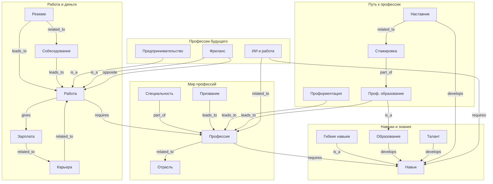

# Раздел 11. Я и будущая профессия

Энциклопедия подростка — рабочий отчёт по разделу о мире профессий, навыках, пути к делу своей жизни, работе и деньгах, а также о том, как работа меняется в будущем.

## 0. Распределение ролей

| Член команды | Блок (3–4 понятия) | Роль |
| :--- | :--- | :--- |
| Участник 1 | Мир профессий | SPARQL-запросы, концептуализация |
| Участник 2 | Навыки и знания | Генерация статей, онтология |
| Участник 3 | Путь к профессии | Генерация статей, оформление |
| Участник 4 | Работа и деньги | Генерация статей, скрипт кросс-ссылок |
| Участник 5 | Профессии будущего | Промпт-инжиниринг, отчёт |

> Раздел содержит **20 понятий** (по 3–4 на участника, при норме 3), сгруппированных в **5 тематических блоков**.

## 1. Выбор темы и концептуализация

Мы выбрали тему «Я и будущая профессия», потому что выбор дела — один из главных вопросов подросткового возраста, и он естественно связывает множество понятий: от абстрактного «призвания» до конкретных «резюме» и «собеседования». Тема богата как иерархическими связями (специальность — часть профессии), так и горизонтальными (резюме связано с собеседованием, ИИ влияет на профессии).

Предметная область разбита на 5 блоков:

| Блок | Понятия |
|------|---------|
| **Мир профессий** | Профессия, Специальность, Призвание, Отрасль |
| **Навыки и знания** | Навык, Гибкие навыки, Образование, Талант |
| **Путь к профессии** | Профориентация, Профессиональное образование, Стажировка, Наставник |
| **Работа и деньги** | Работа, Зарплата, Карьера, Резюме, Собеседование |
| **Профессии будущего** | Предпринимательство, Фриланс, Искусственный интеллект и работа |

## 2. Работа с базами знаний (WikiData)

Для анализа предметной области и сбора структурированных описаний мы использовали SPARQL-запросы к [WikiData](https://query.wikidata.org/). Для каждого блока в `<блок>/scripts/query.py` лежит запрос, который по списку идентификаторов сущностей (QID) выгружает русские метки и описания. Результаты сохранены в `<блок>/data/wikidata_export.json` для автоматического использования при написании текстов.

Пример запроса (блок «Мир профессий»):

```sparql
SELECT ?item ?itemLabel ?description WHERE {
  VALUES ?item {
    wd:Q28640     # профессия
    wd:Q1047113   # специальность
    wd:Q829183    # призвание
    wd:Q268592    # отрасль экономики
  }
  SERVICE wikibase:label { bd:serviceParam wikibase:language "ru,en". }
  OPTIONAL {
    ?item schema:description ?description .
    FILTER(LANG(?description) = "ru")
  }
}
```

Найденные QID ключевых понятий: профессия `Q28640`, специальность `Q1047113`, призвание `Q829183`, отрасль `Q268592`, умение/навык `Q205961`, гибкие навыки `Q15910354`, образование `Q8434`, одарённость `Q467677`, профориентация `Q741939`, профессиональное образование `Q6869278`, стажировка `Q4439145`, наставничество `Q967647`, труд `Q268378`, занятость `Q2266417`, заработная плата `Q6821213`, карьера `Q282049`, резюме `Q950511`, собеседование `Q850171`, предпринимательство `Q3908516`, фрилансер `Q215279`, искусственный интеллект `Q11660`.

## 3. Онтология раздела

Концептуализация содержит **объекты** (20 понятий) и **связи** между ними. Помимо иерархических связей (`is_a`, `part_of`) использованы горизонтальные: `requires`, `gives`, `leads_to`, `develops`, `related_to`, `opposite`.

### Типы связей

| Тип | Смысл | Пример |
|-----|-------|--------|
| `is_a` | разновидность | Гибкие навыки — это вид Навыка |
| `part_of` | часть целого | Специальность — часть Профессии |
| `requires` | требует | Профессия требует Навыков |
| `gives` | даёт | Работа даёт Зарплату |
| `develops` | развивает | Образование развивает Навыки |
| `leads_to` | ведёт к | Профориентация ведёт к Профессии |
| `related_to` | смысловая связь | Резюме связано с Собеседованием |
| `opposite` | противоположность | Фриланс противоположен постоянной работе |

### Диаграмма онтологии (Mermaid)



## 4. Генерация статей

Markdown-странички для всех 20 понятий сгенерированы с помощью генеративной ИИ-модели по промпту вида **«объясни для десятилетнего ребёнка»**: короткие предложения, бытовые аналогии (велосипед, игра, примерка обуви), нейтральный доброжелательный тон без нравоучений. Тексты лежат в `WEB/my_future_profession/<блок>/concepts/`. Список понятий и файлов — в `concepts.json` каждого блока.

## 5. Перекрёстные ссылки

Скрипт [`crosslink.py`](crosslink.py) на Python автоматически расставляет в текстах ссылки `[текст](путь/concept.md)` на все понятия раздела. Падежи обрабатываются двумя способами:

- через список **алиасов** (`aliases`) в `concepts.json`, где для каждого понятия перечислены частые словоформы («профессии», «профессию», «профессией» …);
- опционально через морфологический анализатор **pymorphy2** (если установлен), который нормализует слова автоматически.

Скрипт пропускает уже существующие ссылки, код-блоки и заголовки, ставит не более одной ссылки на понятие в файле и не ссылается из статьи на саму себя. При наличии файлов `concepts.json` других групп ссылки можно расставлять и между разделами.

## 6. Вывод

В ходе работы мы освоили SPARQL и WikiData как источник структурированного знания, спроектировали онтологию из 20 понятий с иерархическими и горизонтальными связями, автоматизировали генерацию связного «детского» текста с помощью LLM и реализовали программную простановку перекрёстных ссылок с учётом русской морфологии. Такой конвейер (граф знаний → генерация → связывание) близок к тому, как устроены современные RAG-системы и базы знаний.
